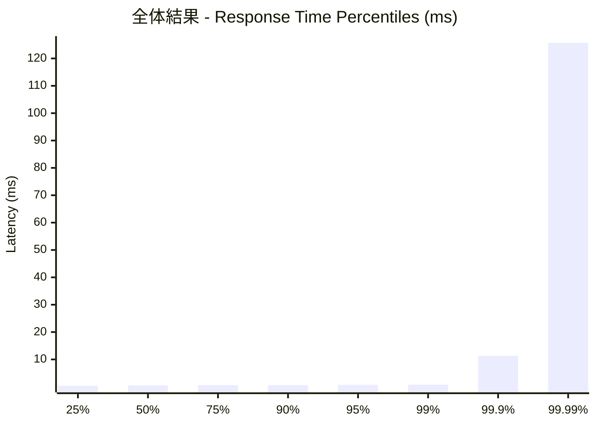
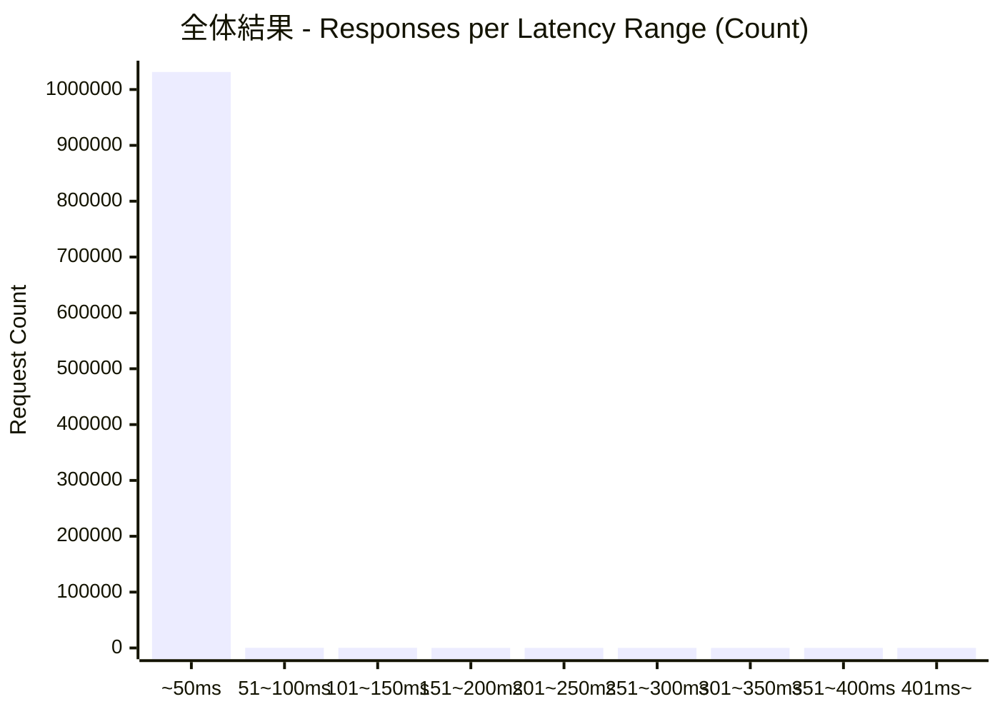
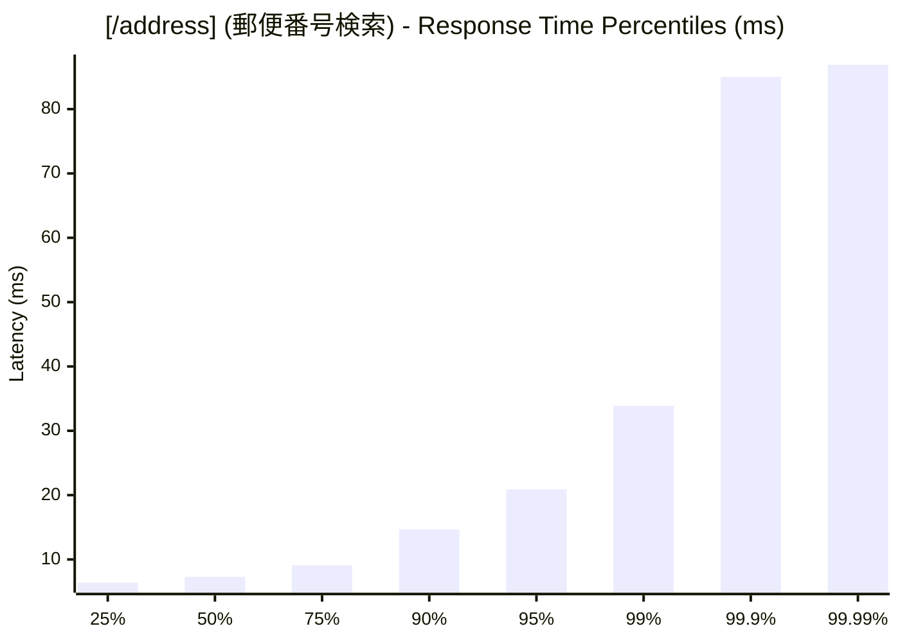
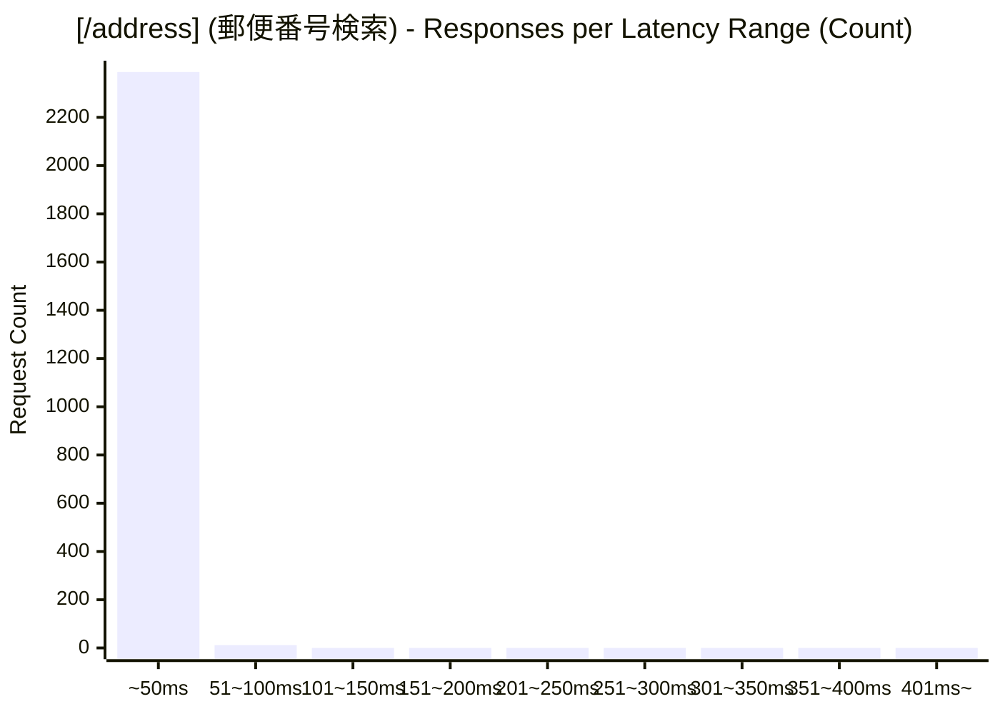
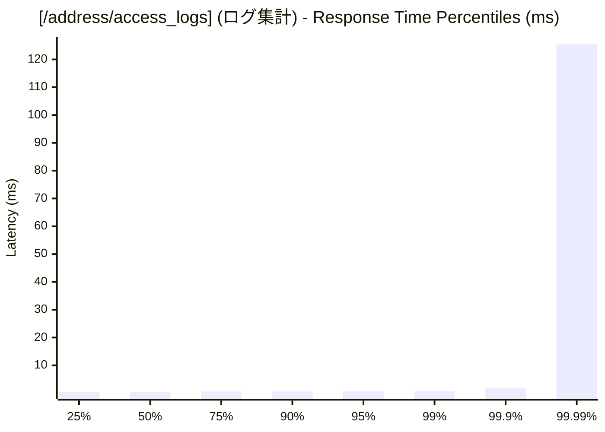
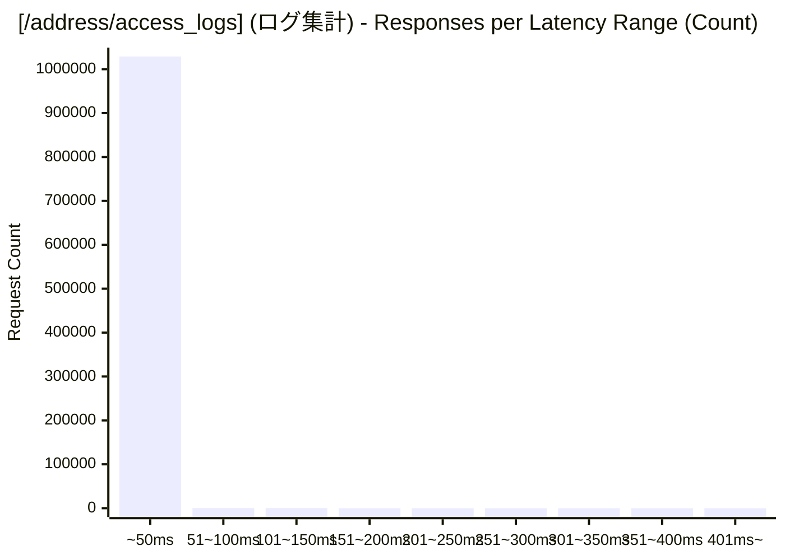

# 負荷テスト結果レポート: go_use_cache_address_mixed_address-mixed_100_30s
テスト実行時間: 30.3405 sec

## エンドポイント別詳細

### 全体結果

| 項目 | 結果 |
| :--- | :--- |
| 成功率 | 99.78% |
| 最遅 | 197.3800 ms |
| 最速 | 0.1500 ms |
| 平均 | 0.5859 ms |
| 毎秒リクエスト数 | 34013.2821/sec |

---

### [/address] (郵便番号検索)
| 項目 | 結果 |
| :--- | :--- |
| 成功率 | 6.54% |
| 最遅 | 87.2070 ms |
| 最速 | 4.9910 ms |
| 平均 | 9.3294 ms |
| 毎秒リクエスト数 | 79.1023/sec |

---

### [/address/access_logs] (ログ集計)
| 項目 | 結果 |
| :--- | :--- |
| 成功率 | 100.00% |
| 最遅 | 197.3800 ms |
| 最速 | 0.1500 ms |
| 平均 | 0.5655 ms |
| 毎秒リクエスト数 | 33934.1799/sec |

